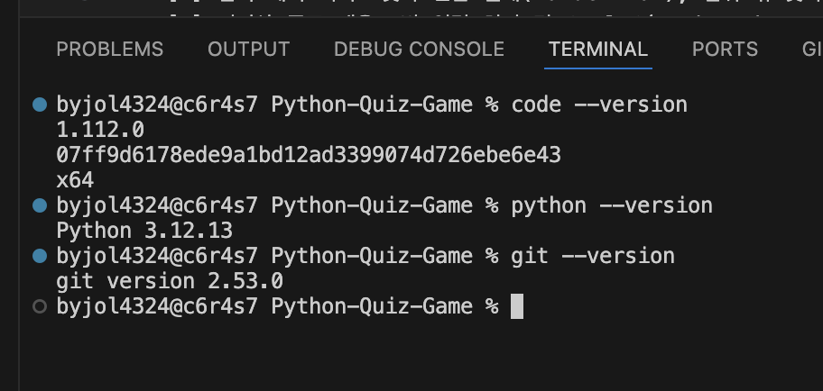

# **프로젝트 개요**
Python과 Git을 활용하여 터미널 환경에서 동작하는 **나만의 퀴즈 게임**을 직접 설계하고 구현한다. 프로그램의 전체 실행 흐름을 만들고 데이터 영속성과 버전 관리를 경험하는데 목적을 둔다. 
- **Python 객체 지향 프로그래밍**: 최소 2개 이상의 클래스를 정의하여 역할을 분리하고,  코드를 역할별로 구조화
- **데이터 영속성 확보**: `state.json` 파일을 활용하여 프로그램 종료 후에도 퀴즈 데이터와 최고 점수를 유지
- **Git을 이용한 이력 관리**: 기능단위 커밋을 통해 개발 과정을 체계적으로 기록하며, 브랜치를 나누어 작업한 뒤 병합하는 워크플로우를 통해 실제 협업의 기초가 되는 버전 관리 프로세스를 경험

<br>

# 1. 실행 환경
- 

<br>

# 2. 수행 체크리스트
**1단계: 저장소 초기 설정**
- [X] GitHub에 새 저장소 만들기
- [X] 로컬 설정
- [X] 기본 파일 생성: .gitignore, README.md
- [X] 새 레파지토리와 연결

**2단계: 핵심 로직 구현 (클래스 및 기능 개발)**
- [X] Quiz 클래스 정의: 문제, 선택지, 정답 속성을 포함한 개별 퀴즈 객체 설계
- [X] 기본 데이터 생성: 직접 정한 주제로 5개 이상의 퀴즈 인스턴스 생성
- [X] QuizGame 클래스 정의: 게임의 핵심 기능(풀기, 추가, 목록, 점수, 종료)을 메서드로 분리

**3단계: 예외 처리 및 프로그램 안정성 확보**
- [X] 입력 예외 처리: 숫자 변환 실패(ValueError), 범위 밖 숫자 입력 등에 대한 방어 코드
- [X] 비정상 종료 대응: 빈 입력 처리 및 Ctrl+C(KeyboardInterrupt) 발생 시 안전한 종료 로직
- [X] 파일 손상 대비: state.json 파일이 없거나 손상되었을 때 기본 데이터로 복구하는 기능

**4단계: 데이터 영속성**
- [X] JSON 입출력: state.json 파일 저장 및 불러오기 구현
- [X] 인코딩 설정: UTF-8 권장

**5단계: 브랜치 생성 및 병합**
- [X] 브랜치 생성 및 전환 (checkout -b dev-yeji)
- [X] 기능별 커밋 최소 10개 이상
- [X] main 브랜치로 합치기 (merge)

**6단계: Git 저장소 복제**
- [X] Git 복제: 다른 폴더에 clone 받고 수정 후 push 실습
- [X] Git pull: 기존 폴더에서 변경사항 가져오기

<br>

# 3. 저장소 초기 설정
## (1) 폴더 및 파일 생성
```bash
$ mkdir Python-Quiz-Game
$ cd Python-Quiz-Game
$ touch .gitignore README.md
```
## (2) 로컬 설정
```bash 
$ git init
```

## (3) 새 저장소 연결 및 확인 
```bash
$ git remote add origin https://github.com/yejibaek12/Python-Quiz-Game.git

$ git remote -v
origin  https://github.com/yejibaek12/Python-Quiz-Game.git (fetch)
origin  https://github.com/yejibaek12/Python-Quiz-Game.git (push)
```
## (4) 커밋 생성
```bash
$ git add .
$ git commit -m "Init: 저장소 초기화 및 기본 파일 생성"
$ git push origin master
```

## 💡 **파이썬 기초**
> **변수 (Variable)** 
> - **정의**: 데이터를 저장하고 관리하기 위해 이름을 붙인 상자
> - **사용 목적**: 복잡한 데이터를 저장해 두었다가 나중에 필요할 때 이름으로 호출하기 위함 

> **데이터 타입** 
>
> | 타입 | 설명 | 예시 | 비유 |
> | :-- | :-- | :-- | :-- |
> | `int`| 정수형 (Integer) | `10`, `-5` | 응답자 수, 점수 등 수치 데이터 |
> | `str` | 문자열 (String) | `"코디세이"`, `"AI"` | 주관식 답변 내용 |
> | `bool`| 불리언 (Boolean) | `True`, `False` | 예/아니오 응답 |
> | `list` | 리스트 (List) | `["철학", "컴공"]` | 객관식 보기 목록 |
> | `dict` | 딕셔너리 (Dictionary) | `{"이름": "예지"}` | 응답자별 프로필 정보 |

> **조건문 (if / elif / else)** 
> - `if`: 만약 조건이 참(True)이라면 실행
> - `elif`: 이전 조건이 거짓일 때, 새로운 조건을 확인
> - `else`: 위의 모든 조건이 거짓일 때 마지막으로 실행

> **반복문 (for / while)**
> - `for`: 리스트나 범위처럼 정해진 목록에서 요소를 하나씩 꺼내며 반복
> - `while`: 설정한 조건이 참(True)인 동안에 코드를 반복 수행 

> **함수 (Function)**
> - **정의**: 반복되는 특정 작업을 수행하기 위해 하나로 묶어놓은 기능 단위
> - **매개변수 (Parameter)**: 함수가 작업을 수행할 때 필요한 재료 (입력값)
> - **반환값 (Return)**: 함수가 작업을 끝내고 최종적으로 돌려주는 결과물 (출력값)


## 💡 **클래스 기초**
> **클래스** 
> - 사용자 정의 데이터 타입으로, 개발자가 필요한 정보(속성)와 수행할 동작(메서드)을 하나로 묶어 새롭게 정의한 틀
> 
> **객체지향 (Object-Oriented)** 
> - 프로그램을 명령어의 나열로 보는 것이 아니라, 데이터와 기능을 하나로 묶은 독립적인 '객체'들의 조립으로 파악하는 프로그래밍 방식
>
> **클래스와 객체의 관계**
> - 클래스가 '붕어빵 만드는 틀'이라면, 객체는 그 틀을 통해 실제로 만들어진 '붕어빵'을 의미함
 
> **속성(attribute)**
> - 객체가 내부에 저장하고 있는 데이터나 정보 
>
> **메서드(method)** 
> - 클래스 내부에 정의되어 객체가 수행하는 동작이나 기능 

> **사용 목적** 
> 1. **효율성**: 연관된 데이터와 기능을 하나로 묶어 관리 효율을 높임
> 2. **재사용성**: 동일한 구조가 필요한 경우 클래스를 통해 반복 생성 가능
> 3. **수정 용이**: 기능 변경 시 해당 클래스 내부만 수정하면 이를 사용하는 모든 객체에 일괄 적용됨

<br>

# 4. 클래스 정의
## (1) 메인 파일 생성
```bash
$ touch main.py 
```

## (2) 라이브러리 임포트
```bash
import json
```

> **`import json` 하는 일**
> - `json.dump()`: 파이썬 데이터를 파일로 저장할 수 있게 번역
> - `json.load()`: 파일에 적힌 내용을 다시 파이썬이 읽을 수 있게 번역

> `>`: 덮어쓰기 <br>
> `>>`: 추가하기

## (3) Quiz 클래스 정의
```bash
class Quiz:
    def __init__(self, question, choices, answer): # 첫 번째 메서드
        self.question = question  
        self.options = choices    
        self.answer = answer

quiz_list = [
    Quiz("나의 전공은?", ["1. 철학", "2. 컴퓨터공학", "3. 정치외교학", "4. 영어영문학"], 1),
    Quiz("코디세이 참여 이유?", ["1. 친구 권유", "2. 프로그래밍 흥미", "3. 장학금", "4. 새 자극"], 2),
    Quiz("개발 프로그램 참여 경험?", ["1. 0회", "2. 1회", "3. 2회", "4. 3회 이상"], 1),
    Quiz("현재 관심 분야는?", ["1. 빅 데이터", "2. AI", "3. IoT", "4. 앱 개발"], 2),
    Quiz("나의 MBTI는?", ["1. INTJ", "2. INFJ", "3. INFP", "4. INTP"], 3),
]      
```

> **퀴즈 주제 선정 이유** 
> - 가장 잘 아는 데이터를 활용해 로직의 정확성을 검증하고, 퀴즈라는 형식을 통해 사용자와 소통하는 도구로 활용할 수 있다.

### 💡 `__init__` 메서드와 `self`
> **`__init__` 메서드 (생성자)**
> - 객체가 생성될 때 자동으로 실행되는 함수로, 객체가 가져야 할 초기 데이터를 세팅하는 역할
>
> **`self` (자기자신)**
> - 클래스 내부에서 현재 다루고 있는 객체 자신을 가리키는 키워드로, 이를 통해 각 객체가 서로 다른 독립적인 데이터를 저장하고 꺼내쓸수 있음

## (4) QuizGame 클래스 정의
```bash
class QuizGame:
    def __init__(self, quizzes): # 첫 번째 메서드
        self.quizzes = quizzes
        self.score = 0
        self.best_score = 0
```
## (5) QuizGame 기능별 메서드 구현
① 메뉴 보여주기
```bash
def display_menu(self): # 두 번째 메서드
    while True: 
        print("\n=== 퀴즈 게임 메뉴 ===")
        print("1. 퀴즈 풀기")
        print("2. 퀴즈 추가")
        print("3. 퀴즈 목록")
        print("4. 점수 확인")
        print("5. 종료")

        choice = input("선택: ").strip()

        if not choice:
            print("⚠️ 메뉴 번호를 입력해주세요.")
            continue

        if choice in ["1", "2", "3", "4", "5"]:
            return choice
        else:
            print("⚠️ 1~5 사이의 숫자를 입력해주세요.")
```

② 퀴즈 풀기 
```bash
def run_quiz(self): # 세 번째 메서드
        print("\n퀴즈 게임을 시작합니다.")
        self.score = 0 

        for quiz in self.quizzes: 
            print(f"\n질문: {quiz.question}")
            for option in quiz.questions:
                print(option)

            answer = input("정답 번호 입력: ")

            if answer == str(quiz.answer):
                print("정답입니다!")
                self.score += 1 
            else:
                print(f"틀렸습니다. 정답은 {quiz.answer}번입니다.")
            
        print(f"모든 문제를 풀었습니다. 최종 점수: {self.score} / {len(self.quizzes)}")

        if self.score > self.best_score:
            print(f"축하합니다. 최고 점수가 갱신되었습니다! ({self.best_score} -> {self.score})")
            self.best_score = self.score
        else:
            print(f"현재 최고 점수는 {self.best_score}점입니다.")
```

③ 퀴즈 추가
```bash
def add_quiz(self): # 네 번째 메서드
    print("\n새로운 퀴즈 추가")
    question = input("질문을 입력하세요: ").strip()

    options = []
    for i in range(1, 5):
        opt = input(f"{i}번 보기를 입력하세요: ").strip()
        options.append(f"{i}. {opt}")

    while True:
        try: 
            answer = int(input("정답 번호를 입력하세요: ")).strip()
            if not answwer:
                print("정답 번호를 입력하세요.")
                continue

            if 1 <= answer <=4:
                break 
            else:
                print("⚠️ 1에서 4 사이의 숫자만 입력 가능합니다.")
        except ValueError:
            print("⚠️ 문자가 아닌 '숫자'를 입력해주세요.")

    new_quiz = Quiz(question, options, answer)

    self.quizzes.append(new_quiz)
    print("퀴즈가 성공적으로 추가되었습니다!")
```

④ 퀴즈 목록 확인
```bash
def show_quiz_list(self): # 다섯 번째 메서드
    print("\n현재 퀴즈 목록")
    if not self. quizzes: 
        print("등록된 퀴즈가 없습니다.")
        return
    for i, quiz in enumerate(self.quizzes, 1): 
        print(f"{i}. {quiz.question}")

def show_score(self):
    print(f"\n현재 당신의 점수는 {self.score}점입니다.")

    if self.score == len(self.quizzes):
        print("축하해요! 모든 문제를 맞혔습니다!")
    
    elif self.score >= 4:
        print("대단해요! 거의 다 맞혔네요.")

    elif self.score > 0:
        print("아쉬워요! 한 번 더 도전해보세요.")

    else:
        print("아직은 0점이네요. 1번을 눌러 퀴즈를 풀어보세요.")
```

<br>

# 5. 메인 실행 부분
```bash
game = QuizGame(quiz_list) 
game.load_data()

try: 
    while True: 
        user_choice = game.display_menu()

        if user_choice == "1":
            game.run_quiz()

        elif user_choice == "2":
            game.add_quiz()
            game.save_data()
    
        elif user_choice == "3":
            game.show_quiz_list()

        elif user_choice == "4":
            print("당신의 최고 점수를 확인합니다.")

        elif user_choice == "5":
            game.save_data()
            print("퀴즈 풀기를 종료합니다.")
            break 
        
        else:
            print("⚠️ 잘못된 입력입니다. 1~5 사이의 숫자를 입력해주세요.")

except KeyboardInterrupt:
    print("\n사용자에 의해 강제 종료 신호(Ctrl+C)가 감지되었습니다.")
    game.save_data() 
    print("데이터를 안전하게 저장한 후 프로그램을 종료합니다.")

except EOFError as e: 
    print(f"\n예상치 못한 오류가 발생했습니다: {e}")
    game.save_data()
```

<br>

# 6. 파일 저장/불러오기 (state.json)
## (1) 라이브러리 임포트
```bash
# main.py 파일 최상단
import json
```
## (2) 파일 저장 로직 (save_data)
```bash
def save_data(self): # 여섯 번째 메서드 
    quiz_data_list = []
    for quiz in self.quizzes:
        quiz_data_list.append({
            "question": quiz.question,
            "options": quiz.options,
            "answer": quiz.answer
        })
        
    all+data = {
        "quizzies": quiz_data_list,
        "best_score": self.best_score
    }

    with open("state.json", "w", encoding="utf-8") as f:
        state.json(all_data, f, ensure_ascii=False, indent=4)
    
    print("\n모든 데이터가 파일에 저장되었습니다.")
```

## (3) 파일 불러오기 로직 (load_data) 
```bash
def load_data(self): # 일곱 번째 메서드
    try:
        with open("state.json", "r", encoding="utf-8") as f:
            all_data = json.load(f)
            
            self.best_score = all_data.get("best_score", 0)

            self.quizzes = []
            for item in all_data["quizzes"]: 
                self.quizzes.append(Quiz(item["question"], item["options"], item["answer"]))
                print("\n기존 데이터를 성공적으로 불러왔습니다. (현재 최고 점수: {self.best_score}점)")
    
    except (FileNotFoundError, json.JSONDecodeError): 
        print("\n저장된 파일이 없습니다. 기존 퀴즈로 시작합니다.")
        self.best_score = 0
```

<br>

# 7. 브랜치 생성 및 병합
## (1) 현재 브랜치 위치 확인
```bash
$ git branch
* master
```

## (2) 새 브랜치 생성 및 이동
```bash
$ git checkout -b dev-yeji 
Switched to a new branch 'dev-yeji'
```

## (3) 현재 활성화된 브랜치 확인
```bash
$ git branch
* dev-yeji
  master
```

## (4) 브랜치에 저장
```bash
$ git add .
$ git commit -m "Feat: dev-yeji 브랜치 생성"
$ git push origin dev-yeji
```

## (5) 메인 브랜치로 병합
### ① 메인 브랜치로 이동
```bash
$ git checkout master
Switched to branch 'master'
```

### ② 작업 브랜치 병합
```bash
$ git merge dev-yeji
```

### ③ 원격 저장소에 반영
```bash
$ git push origin master
```

### ④ (선택) 병합이 완료되어 더 이상 사용하지 않는 브랜치 삭제 
```bash
$ git branch -d dev-yeji
Deleted branch dev-yeji
```
<br>

# 8. Git 저장소 복제 실습
## (1) 저장소 복제 (clone)
```bash
# 새로운 폴더로 이동 후 실행
$ git clone https://github.com/yejibaek12/Python-Quiz-Game.git
```

## (2) 복제된 저장소에서 수정 및 반영
```bash
# README.md 한 줄 추가 등 수정 후
$ git add README.md
$ git commit -m "Docs: 복제된 저장소에서 README 수정 실습"
$ git push origin master
```

## (3) 기존 작업 디렉터리에서 변경사항 가져오기 (pull)
```bash
# 원래 작업 폴더로 이동 후 실행
$ git pull origin master
```

## (4) 최종 확인
```bash
# 파일 내용 확인
$ cat README.md
```